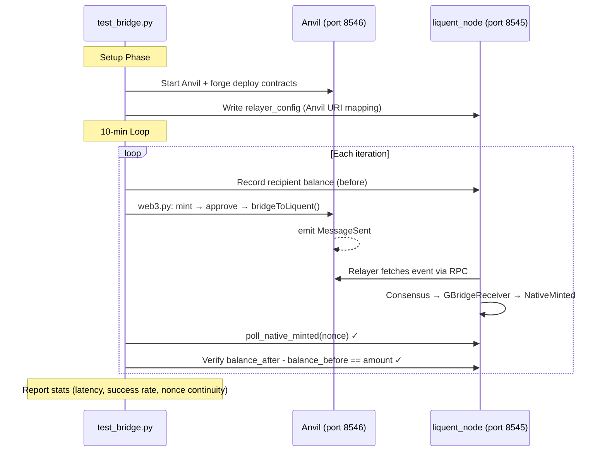

# Bridge E2E Test Suite

Tests the full bridge flow from an external EVM chain (Anvil) to the Liquent chain, verifying cross-chain token minting via oracle consensus.

## End-to-End Data Flow



## Prerequisites

- **Anvil** (from foundry) installed and in PATH
- **forge** installed and in PATH  
- **liquent_chain_core_contracts** repo available (default: `~/projects/liquent_chain_core_contracts`)
- **liquent_node** binary built

## How to Run

### Via the runner script

```bash
cd liquent/liquent_e2e
./run_test.sh bridge
```

### Directly with pytest

```bash
# From liquent_e2e/ directory
pytest cluster_test_cases/bridge/test_bridge.py \
    --cluster-config cluster_test_cases/bridge/cluster.toml \
    --contracts-dir ~/projects/liquent_chain_core_contracts \
    --bridge-duration 600 \
    -v -s
```

### Custom duration (e.g., 1 minute for quick smoke test)

```bash
pytest cluster_test_cases/bridge/test_bridge.py --bridge-duration 60 -v -s
```

## Configuration

### `cluster.toml`

Single-node cluster with oracle + bridge config:

- `oracle_config.bridge_config.deploy = true` — deploys `GBridgeReceiver` at genesis
- `oracle_config.bridge_config.trusted_bridge` — points to Anvil's `GBridgeSender` (deterministic address)
- `oracle_config.tasks` — watches Anvil (chainId 31337) for `MessageSent` events on `LiquentPortal`

### Relayer config

Dynamically written by the `anvil_bridge` fixture into each node's config dir:

```json
{
  "uri_mappings": {
    "liquent://0/31337/events?contract=0xe7f1...&eventSignature=0x5646...&fromBlock=0": "http://localhost:8546"
  }
}
```

## Contract Addresses (Anvil Deterministic)

| Contract | Address | Function |
|----------|---------|----------|
| MockGToken | `0x5FbDB2315678afecb367f032d93F642f64180aa3` | ERC20 token on Anvil |
| LiquentPortal | `0xe7f1725E7734CE288F8367e1Bb143E90bb3F0512` | Message relay on Anvil |
| GBridgeSender | `0x9fE46736679d2D9a65F0992F2272dE9f3c7fa6e0` | Bridge entry point on Anvil |
| GBridgeReceiver | `0x595475934ed7d9faa7fca28341c2ce583904a44e` | Genesis-deployed on Liquent |

## File Structure

```
liquent_e2e/
├── liquent_e2e/utils/
│   ├── anvil_manager.py      # Anvil process lifecycle + forge deploy
│   └── bridge_utils.py       # BridgeHelper, poll_native_minted, BridgeStats
└── cluster_test_cases/bridge/
    ├── README.md              # This file
    ├── cluster.toml           # Single-node cluster config
    ├── conftest.py            # anvil_bridge + bridge_helper fixtures
    └── test_bridge.py         # 10-min continuous bridge loop test
```
